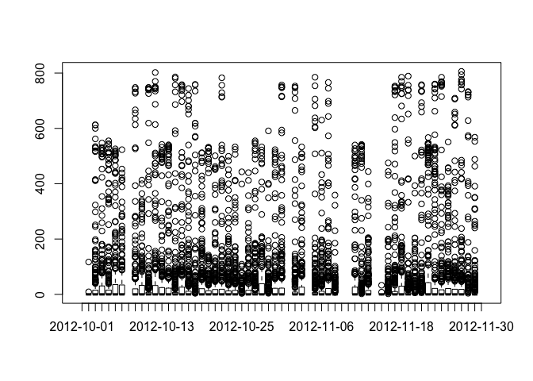
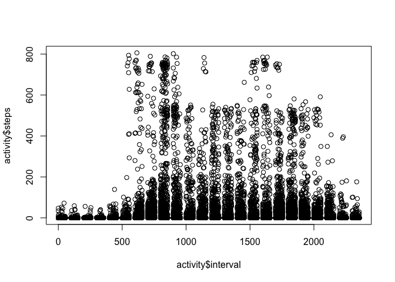
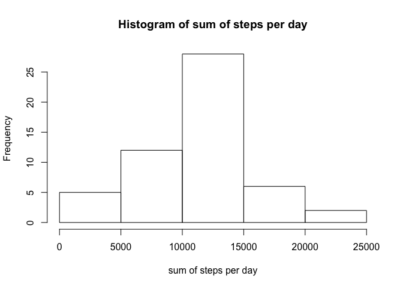
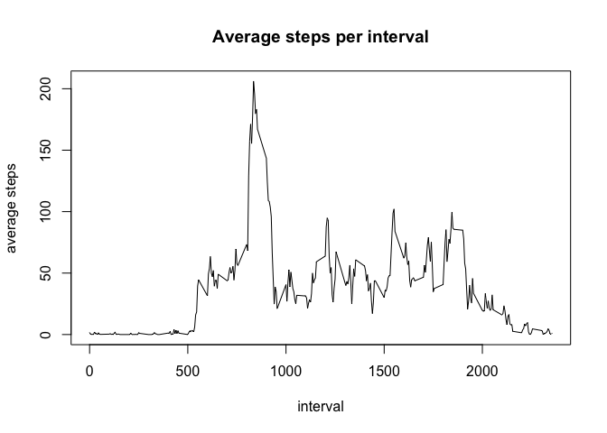
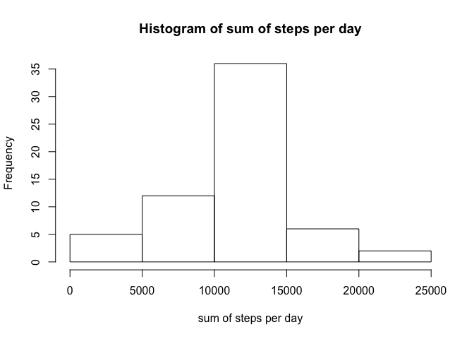
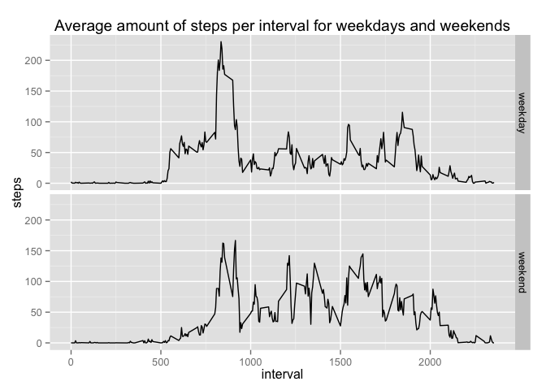

# Reproducible Research: Peer Assessment 1

The data for this assignment was downloaded on 06-11-2015 from the Coursera website:
https://d396qusza40orc.cloudfront.net/repdata%2Fdata%2Factivity.zip
The dataset is stored in a comma-separated-value (CSV) file and there are a total of 17,568 observations in this dataset.

## Loading and preprocessing the data
First the data must be loaded.
Then I take a look at the data to get a better idea.


```r
activity <- read.csv("activity.csv")
summary(activity)
```

```
##      steps                date          interval     
##  Min.   :  0.00   2012-10-01:  288   Min.   :   0.0  
##  1st Qu.:  0.00   2012-10-02:  288   1st Qu.: 588.8  
##  Median :  0.00   2012-10-03:  288   Median :1177.5  
##  Mean   : 37.38   2012-10-04:  288   Mean   :1177.5  
##  3rd Qu.: 12.00   2012-10-05:  288   3rd Qu.:1766.2  
##  Max.   :806.00   2012-10-06:  288   Max.   :2355.0  
##  NA's   :2304     (Other)   :15840
```

```r
head(activity)
```

```
##   steps       date interval
## 1    NA 2012-10-01        0
## 2    NA 2012-10-01        5
## 3    NA 2012-10-01       10
## 4    NA 2012-10-01       15
## 5    NA 2012-10-01       20
## 6    NA 2012-10-01       25
```

```r
plot(activity$date, activity$steps)
```

 

```r
plot(activity$interval, activity$steps)
```

 

## What is mean total number of steps taken per day?
For this part of the assignment, you can ignore the missing values in the dataset.
Calculate the total number of steps taken per day and make a histogram of the total number of steps taken each day.

In order to calculate the sum, I use the package 'dplyr'.
First I group the data by date and leave out the missing values.
Then I get the sum of the steps per date.


```r
library(dplyr)
```

```
## 
## Attaching package: 'dplyr'
## 
## The following objects are masked from 'package:stats':
## 
##     filter, lag
## 
## The following objects are masked from 'package:base':
## 
##     intersect, setdiff, setequal, union
```

```r
activitydate <- group_by(na.omit(activity), date)
activitysum <- summarise(activitydate, sumsteps=sum(steps))
hist(activitysum$sumsteps,
     main="Histogram of sum of steps per day",
     xlab="sum of steps per day")
```

 

```r
## alternative with package 'reshape2', I'm still looking for the best or easiest way....
# library(reshape2)
# activity2 <- melt(activity, id.vars="date", measure.vars="steps", na.rm=TRUE)
# activitysum <- dcast(activity2, date ~ variable, sum)
```

Calculate and report the mean and median of the total number of steps taken per day.


```r
mean(activitysum$sumsteps)
```

```
## [1] 10766.19
```

```r
median(activitysum$sumsteps)
```

```
## [1] 10765
```

The mean amount of steps per day is 10766.19
The median amount of steps per day is 10765

## What is the average daily activity pattern?
Make a time series plot (i.e. type = "l") of the 5-minute interval (x-axis) and the average number of steps taken, averaged across all days (y-axis)

Again I use the package 'dplyr'.
First I group the data by interval.
Then I get the mean of the steps per interval.


```r
activityinterval <- group_by(na.omit(activity), interval)
activitymean <- summarise(activityinterval, meansteps=mean(steps))
plot(activitymean$interval, activitymean$meansteps, type="l",
     main="Average steps per interval",
     xlab="interval",
     ylab="average steps")
```

 

Which 5-minute interval, on average across all the days in the dataset, contains the maximum number of steps?

First I have to find the row with the maximum number of steps.
Then I have to find the corresponding interval


```r
rowmaxsteps <- which.max(activitymean$meansteps)
activityinterval[rowmaxsteps,]
```

```
## Source: local data frame [1 x 3]
## Groups: interval [1]
## 
##   steps       date interval
##   (int)     (fctr)    (int)
## 1     0 2012-10-02      835
```

The maximum number of steps is in interval 835

## Imputing missing values
Note that there are a number of days/intervals where there are missing values (coded as NA). The presence of missing days may introduce bias into some calculations or summaries of the data.

Calculate and report the total number of missing values in the dataset (i.e. the total number of rows with NAs)


```r
sum(is.na(activity$steps))
```

```
## [1] 2304
```
There are 2304 missing values

Devise a strategy for filling in all of the missing values in the dataset. The strategy does not need to be sophisticated. For example, you could use the mean/median for that day, or the mean for that 5-minute interval, etc.

Create a new dataset that is equal to the original dataset but with the missing data filled in.

I am going to replace the missing values with the mean for that 5-minute interval.
I'm going to do this in a new dataframe: activity2
I allready have that data in the dataframe 'activitymean'.
I use a loop to do this: first I find a missing value.
Second I find the corresponding interval.
Third I find the row of that interval in the dataframe activitymean.
Fourth I select the mean of that interval
Fifth I replace the missing value with that mean.


```r
activity2 <- activity
for(i in 1:nrow(activity2)) {
      if(is.na(activity2$steps[i])) {
            missinginterval <- activity2$interval[i]
            rowmisinterval <- which(activitymean$interval ==  missinginterval)
            meanmisinterval <- activitymean$meansteps[rowmisinterval]
            activity2$steps[i] <- meanmisinterval
      }
}
```

Make a histogram of the total number of steps taken each day and Calculate and report the mean and median total number of steps taken per day. Do these values differ from the estimates from the first part of the assignment? What is the impact of imputing missing data on the estimates of the total daily number of steps?


```r
activity2date <- group_by(activity2, date)
activity2sum <- summarise(activity2date, sumsteps=sum(steps))
hist(activity2sum$sumsteps,
     main="Histogram of sum of steps per day",
     xlab="sum of steps per day")
```

 

```r
mean(activity2sum$sumsteps)
```

```
## [1] 10766.19
```

```r
median(activity2sum$sumsteps)
```

```
## [1] 10766.19
```

Without the missing values:
mean = 10766.19
median = 10765

With the imputed values to replace the missing values:
mean = 10766.82
meadian = 10766.19

So after imputing the missing data, the values for both mean and median are a little higher.

## Are there differences in activity patterns between weekdays and weekends?
For this part the weekdays() function may be of some help here. Use the dataset with the filled-in missing values for this part.

Create a new factor variable in the dataset with two levels – “weekday” and “weekend” indicating whether a given date is a weekday or weekend day.

Make a panel plot containing a time series plot (i.e. type = "l") of the 5-minute interval (x-axis) and the average number of steps taken, averaged across all weekday days or weekend days (y-axis). See the README file in the GitHub repository to see an example of what this plot should look like using simulated data.

First I have to set the right Timezone.
Then I have to change the variable 'date' to an actual date.
Then I make the new variable 'day'.
Another variable wil be used as 'daytype' which will include 'weekday' and 'weekend'.
The standard value will be 'weekday'


```r
Sys.setlocale("LC_TIME", "C")
```

```
## [1] "C"
```

```r
activity2$date <- as.Date(activity2$date)
activity2$day <- weekdays(activity2$date)
activity2$daytype <- c("weekday")
```

Now the daytype has to be changed for saterday and sunday.
Again I use a loop to do this.
I change the variable 'daytype' to a factor.
For the plot I need to have the average steps per interval and daytype.
I use the aggregate-function to do this.


```r
for(i in 1:nrow(activity2)) {
      if (activity2$day[i] == "Saturday" | activity2$day[i] == "Sunday") {
            activity2$daytype[i] <- c("weekend")
      }
}
activity2$daytype <- as.factor(activity2$daytype)
activity2agg <- aggregate(steps ~ interval * daytype, data = activity2, FUN=mean)
```

To make a panel plot I use the package 'ggplot2'


```r
library(ggplot2)
qplot(interval, steps, data = activity2agg,
      facets = daytype ~ .,
      geom = "line",
      method = "lm",
      main = "Average amount of steps per interval for weekdays and weekends")
```

 

